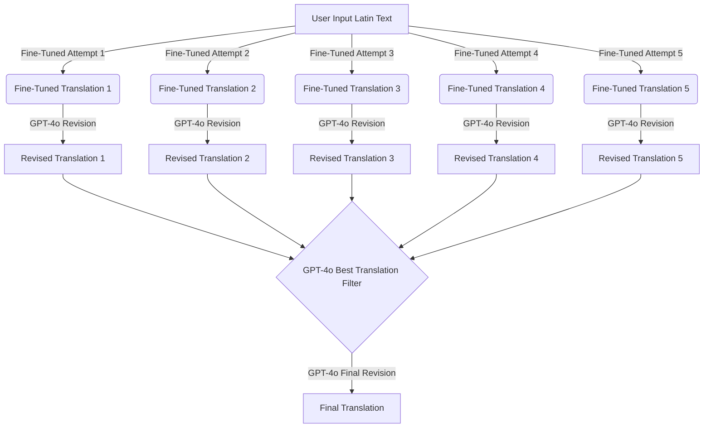

# LITERA: Fine-Tuning and Testing Data for Latin-to-English Translation

This repository contains the data and scripts used in the development of LITERA, a state-of-the-art Latin-to-English translation platform utilizing a fine-tuned version of GPT-4o-mini and GPT-4o. The purpose of this repository is to provide the resources necessary for reproducing the fine-tuning process and testing the model's performance on classical and early modern Latin texts.

## Repository Contents

- **Fine-Tuning Data**: A collection of parallel Latin-English sentences used for fine-tuning GPT-4 models. This dataset was carefully curated in collaboration with the Duke University Classics Department to ensure high-quality translations.

- **Classical Latin Test Set**: A dataset of classical Latin sentences used to evaluate the performance of the fine-tuned model. This set includes sentences from works by Cicero, Virgil, Ovid, and other classical authors.

- **Modern Latin Test Set**: A dataset of early modern Latin sentences sourced from the University of Warwick’s Neo-Latin anthology. This set was used to assess the model's versatility across different periods of Latin literature.

- **Python Scripts**: Scripts for performing API calls to the LITERA model, including the necessary prompts for translation and revision. These scripts can be used to replicate the translation process described in the LITERA paper.

  - `translate.py`: The main script for translating Latin text using the fine-tuned LITERA model. This script handles multiple translation attempts and revisions to produce the best possible translation. This also inlcudes a function for generating non-literal translations that prioritize fluency and readability over strict adherence to Latin syntax.
  
- **Model Prompts**: All of the prompts used for the various layers in LITERA. 

## How to Fine-Tune the Model

Although the fine-tuned models themselves cannot be shared due to OpenAI's policies, you can reproduce the fine-tuning process using the provided dataset and hyperparameters.

### Steps to Fine-Tune:

1. **Prepare Your Dataset**: Organize your Latin-English parallel corpus following the format provided in this repository.
  
2. **Navigate to OpenAI's Fine-Tuning Page**: Visit [OpenAI's fine-tuning page](https://platform.openai.com/finetune) to begin the fine-tuning process.

3. **Create a Fine-Tuning Job**: Choose `gpt-4o-mini` or a similar model as the base. Upload the dataset from this repository.

4. **Set Hyperparameters**: Use the following settings:
   - **Epochs**: 3
   - **Batch Size**: 1
   - **Learning Rate Multiplier**: 1.8
   - **Seed**: Random
   - **Validation Metrics**: Leave empty

5. **Start Fine-Tuning**: Once the job is complete, the fine-tuned model will be ready for API calls. Update your script with the model's job name.

For those unfamiliar with the process, further instructions are available in the [OpenAI Fine-Tuning Guide](https://platform.openai.com/docs/guides/fine-tuning).

## How the Model Works

The LITERA model is designed to tackle the complexities of Latin translation through a multi-layered approach. Below is a visual representation of the process:

This multi-step process ensures high accuracy and adherence to Latin grammar and syntax, producing translations suitable for academic use.

## Try It Out

You can experience the LITERA translation model in action at [Osmos Learn](https://translate.osmoslearn.com).

## License

This project is licensed under the Creative Commons Attribution 4.0 International License (CC BY 4.0). See the [LICENSE.md](LICENSE.md) file for details.
